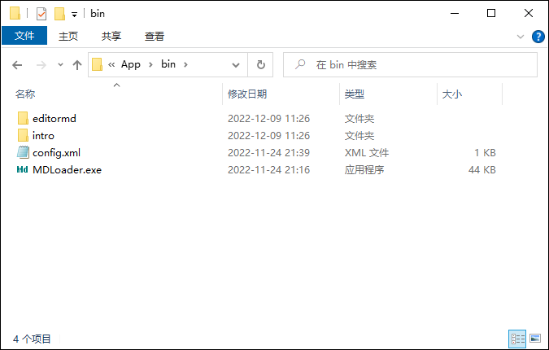

# APP Loader 简易使用说明书

## 使用方法简介

APP Loader为用户提供了两种打包方式：离线完整安装包和最小化在线安装包。升级配置方式也提供了两种方式：内置打包配置，外置xml配置文件。这两种方法可以任意组合。推荐的组合方式是：

- 最小化在线升级包，外置打包配置 （配置最省事，灵活）
- 最小化在线升级包，内置打包配置 （发布的文件最小）
- 全内置，即完整安装包，内置打包配置 （用户最方便）

下面我会分别介绍使用方法。

## 程序包的生成与发布

程序包的生成是生成程序包裹跟实现动态在线升级的公共步骤。在生成之前，您最好首先准备一个支持FTP功能的Web服务器，绝大多数的基础版云服务器都可以满足这个要求。如果您尚不拥有Web服务器，或者只是试验性的使用本软件，不想架设相关服务，只要您能找到一个可以提供文件下载的站点，仍然是可以正常使用本项目的。后面我会以使用开源Gitee源码管理平台当文件服务器为例做一个简易的免服务器，介绍一下使用方法。

### 一. 使用程序包生成工具部署升级文件

使用APP Loader的第一步需要将您的程序包打包成压缩包，并上传到服务器供用户进行升级下载。 为了让这个操作自动化，我编写了OTAPG包生成工具，负责升级包以及相关配置文件的自动生成及上传。

#### 1. 服务器端的配置

*提醒: 如果您不打算使用自己的Web服务器，可以先跳过这一个步骤，直接看第二小节OTAPG使用方法*

首先，我们假定您已经租用了一台云服务器，并且绑定到了相应的域名，且开通了Web服务与FTP服务。这部分的教程您可以在百度上搜索“WEB、FTP服务器的搭建",我使用的是UPUPW集成控制面板，您也可以在网址https://www.upupw.net/ 中找到相应的搭建教程。

服务端配置步骤：
将FTP的根目录映射到某一个有效的Web路径，比如我登录ftp.miuser.net后，上传一个叫abc.pack的文件，然后可以通过https://www.miser.net/AppOTA/MDLoader/abc.pack 这个路径访问就可以了，目录不需要跟我例子保持一致，只要是您的FTP根目录可以被Web路径访问就行。

#### 2. OTAPG的使用方法

##### 界面简介：

进入APP_PackageGenerator目录，运行 PackageGenerator.exe，可以看到如下界面：

1，2区域是用户用来选择文件的区域。
1. 您需要在1号区域里选中您的程序要包括的所有程序文件，默认是全选的，建议您可以剔除供升级类的文件包，如本例中的unpack目录等，以减小安装包的尺寸。您也可以剔除其他不必要的程序生成的附加文件，但必须能包含程序需要运行的全部文件。
2. 在安装过程中，有一些用户文件是程序运行所必需的，但往往在较早的版本中用户已经做了更改，这些包括用户自己修改了的源码，或者配置文件等，在升级过程中，这些文件是我们需要跳过不进行覆盖操作的，这些文件需要您在2号区域中手动选出。2号区域默认是空的，也就是安装文件将覆盖掉所有的早期版本已经存在的文件。

3号区域是显示生成的过程的，您可以浏览到压缩包的生成情况。在运行开始时也提示了基本的操作流程供您参考。

4号区域是升级文件包的配置，其中绿色的部分是可改写的，灰色部分是由程序负责生成的。

5号区域是程序的主控面板，从左向右按次序点击即可完整程序包的生成和上传的全过程。在执行过程中需要根据3号区域的提示，在1，2，4区域的相关操作进行配合，并不是一路直接点下去^_^

##### 参数设置

*提醒: 如果您不打算使用自己的Web服务器，下面的信息可以保持为空。

服务器的信息，在配置菜单中要首先配置好

2. Password：您的FTP服务器的登陆密码
3. Port：您的FTP服务器的端口号，默认是21
4. ServerAddress: 您的FTP服务器的域名或者IP地址
5. UserName:您的FTP服务器的登陆密码

##### 使用实例

我们以开源免费的MDLoader文件编辑器为例，实际的演示一下程序包生成器的使用方法。例子用到的文件保存在项目的App目录下。

1.  首先我们在您下载的工程目录下的App目录下的Bin目录放置MDLoader的程序文件。其中MDLoader.exe为MD文件编辑器的主程序，config.xml为编辑器的配置文件，其余文件都是程序的支持性文件。MDLoader开源Markdown文件编辑器项目的详细情况您可以直接参考源码地址：https://gitee.com/miuser00/md-fileloader

2.  APPLoader的二进制可执行文件“APPLoader.exe”与配置文件“config.xml"已经存在在App目录中了, "config.xml"文件在后面OTAPG生成安装配置阶段程序还会更新。

3.  点击选择安装程序目录，然后选择待打包的程序目录，比如我的路径为 C:\OneDrive\project\LuaStudio\APPLoader\App

4.  左侧树形列表中是我们要打包的程序文件，默认为全选，其中我们发现有两个程序文件"AppLoader.exe.config"，"AppLoader.pdb" 是VS生成的调试文件，对用户没有用，所以把这两个文件清除掉。MDLoader的配置文件是config.xml,我们希望软件包在线升级的时候不要被新程序冲掉，所以所以在右侧的树形列表中显示的排除列表里把这文件选中。
**提醒：如果您已经做过一些其他操作可能发现文件夹还包含了其他文件，在这一步也要把这些文件和文件夹排除掉*

5. 右下方的配置信息如下：
	程序的版本号应该和您的应用程序的版本号保持一致，我们要打包的MDLoader版本为V0.43，所以这里也输入0.43
	程序启动路径点击浏览按钮选择为bin目录下的MDLoader.exe
	程序名设置为MDLoader
	服务器路径根据您的实际情况修改，我的FTP的根目录映射到的Web地址为 https://www.miuser.net/AppOTA/MDloader
**提醒：如果您使用的是gitee源码管理平台部署升级文件，这里应该填入其中miuser00是我的gitee用户名，您应该改成您自己的* https://gitee.com/miuser00/MDLoaderOTA/releases/download/1.0

6. 最后点击生成安装配置。片刻后，系统会生成两个配置文件upgrade.xml和config.xml，文件内容在Log部分有显示，可以看一眼是否跟期望的一致，如果您是高手，也可以手动进行一些必要的编辑，字段的定义本身并不复杂。

7.  这个步骤完成后，直接点击生成安装文件和发布。程序将完成后续的程序打包及上传工作，整个过程的具体步骤在Log中都有显示，比如您可以查看最终压缩包的大小，上传的完成情况等。

*提醒：如果您打算使用的是gitee源码管理平台部署升级文件，上传过程中会提示Fail，请继续后面步骤的手动上传文件即可。

### 二、使用Gitee源码管理平台部署升级文件

如果您没有打算架设文件服务器，配合简单的设置也可以使用Gitee开源项目管理平台管理您的升级包。 首先您需要在Gitee官网拥有一个账号。并且本地安装了GitGui管理软件，以下链接可以找到相应的教程：https://www.baidu.com/s?wd=Gitgui%E5%92%8Cgitee 然后通过 "发行版" 方式发布您的OTA升级包。

####1. Gitee配置

使用您的账户密码登录Gitee网站，并新建一个名为MDLoaderOTA的开源项目，并将项目设置为公开，不然升级文件无法正常下载。将新建的gitee项目进行初始化，如增加一个readme文件,否则后续步骤无法进行。

####2. 上传程序文件包

选择新建发行版，并上传我们刚刚生成的程序包，文件项目文件夹的RelPack子目录下，把三个文件都上传到发行版拖拽窗体，并确认生成。

版本输入“1.0”，名称输入MDLoaderOTA发行版，介绍输入MDLoaderOTA发行版，然后点击创建发行版。

## 发行您的程序

打开项目文件夹的App子目录，此目录中的可执行文件与config.xml，就是最终发布的应用程序。如果您是Web方式发布的应用程序，则直接将这两个文件发布给您的用户即可。

*如果您使用的是gitee方式发布，您需要从记事本打开config.xml并修改AppVerXmlUrl字段为如下内容：https://gitee.com/miuser00/MDLoaderOTA/releases/download/1.0/upgrade.xml

### 三、单可执行文件方式发布程序

细心的您一定发现，上述发行的程序包除了一个Loader的exe格式可执行文件外还有一个config.xml配置文件。同时，默认的Loader采用的是最小化在线安装方式，也就是说用户首次运行程序，需要从网络下载最新的程序文件。这些都可能会给用户带来一些不便，下面我们将介绍如何将完整的程序打包进单一的可执行文件的方法，同时也将支持离线安装程序。

**提醒：首先您需要安装VS2019，做到这一步的都是进阶大佬们了，我就不多啰嗦安装方法了。*

2. 生成最小化在线安装程序：
用VS2019打开本项目的源码，然后点击“显示所有文件”，会看到config目录下包含虚化的文件"config.xml"，这是打包配置文件。如果您想发布最小的单个可执行程序，则将config目录中的文件包括进来，具体方式是右键选择包括在项目中，然后再次点击右键"属性"，生成方式改为嵌入的资源即可。

3. 生成离线完整安装程序：
与上述方式类似，将config目录和Binapp目录中的四个文件都包含在项目中，并修改生成方式为嵌入式资源即可。

**提醒：独立安装程序中包含的文件都是在OTAPG程序中生成的，所以编译操作之前，上述包生成一定要先做完，顺序不能颠倒。*

**感谢您阅读本文档，祝您一切顺利，谢谢。**
